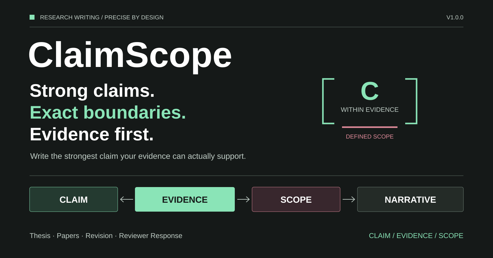
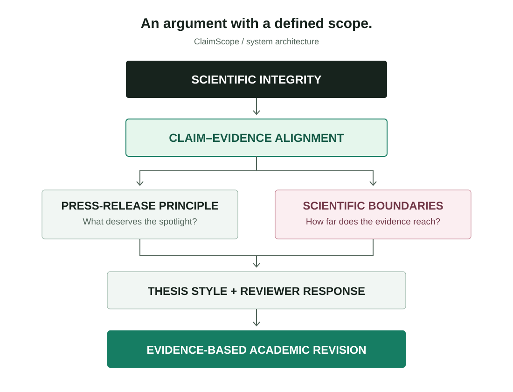
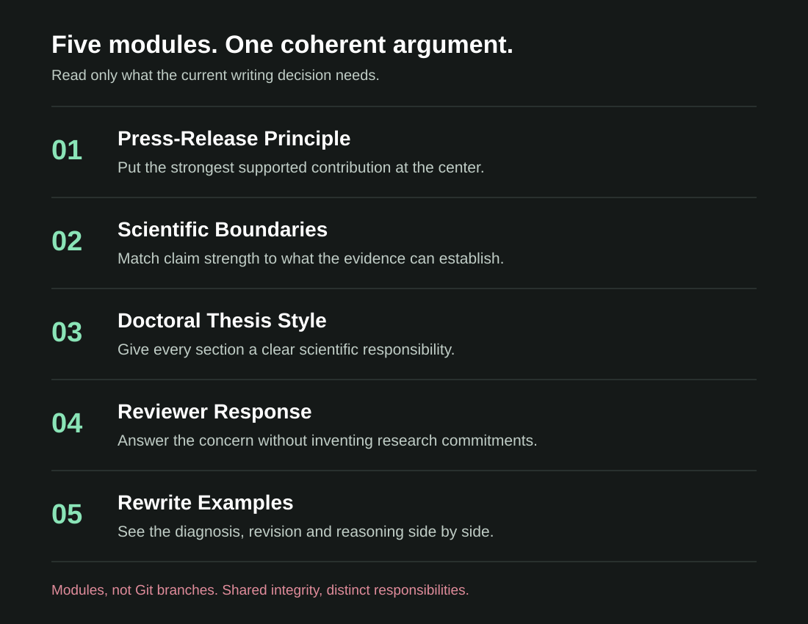
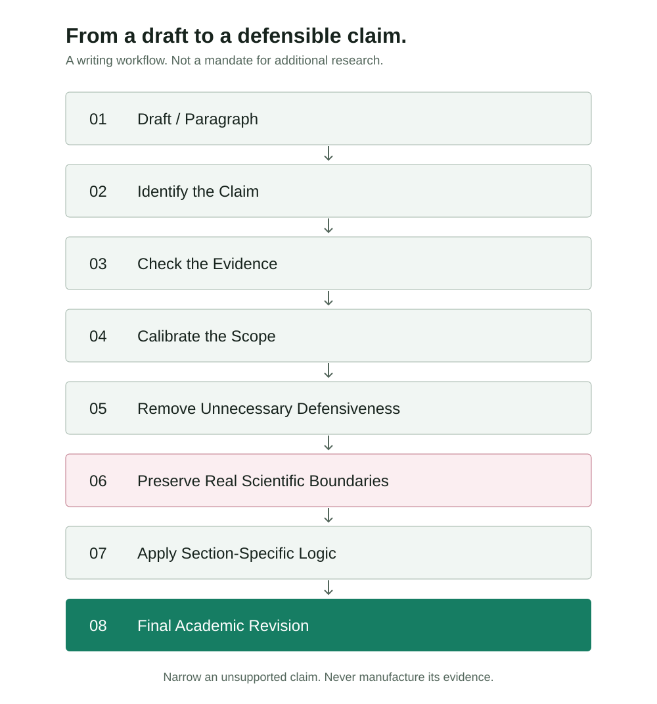

[English](README.md) | [简体中文](README.zh-CN.md)

# ClaimScope

**强主张，准边界，证据优先。**

ClaimScope 是一个面向科研写作的模块化 Skill，用于协调科学主张、证据、研究边界、论文叙事与审稿回复策略。




[](LICENSE)

**让科学主张、证据与研究边界精确匹配。**

它不是简单“去 AI 味”，也不是单纯把文字改得更大胆，而是判断：**当前证据究竟允许论文说到什么程度？**
面向博士生、硕士生、高校教师、科研人员和 SCI 作者，既处理段落，也处理整篇论文的论证职责。

## 同一份证据，三种表达

以下为虚构示意：已有观测支持所测工况下 X 与 Y 的一致关联，但没有证明因果机制。

| 过度防御 | 过度声称 | ClaimScope |
| --- | --- | --- |
| 尽管获得了一些有用观察，但必须承认仅考虑了所测加载工况，因此结果应谨慎解释。 | 结果普遍证明了控制机制。 | 在所测加载工况下，观测结果显示 X 与 Y 存在一致关联。 |

**不是写得更保守，也不是写得更大胆，而是让科学主张与证据边界精确匹配。**

它先判断：论文可以主张什么？依据是什么？适用于哪些条件？哪些结果承担主线证明责任？这一章应完成什么任务？审稿人的问题真的需要新增试验吗？

## 与其他写作工具有什么不同？

| 类型 | 常见关注点 | 主要层级 |
| --- | --- | --- |
| Humanizer | AI 式措辞、重复、句式节奏和连接语 | 句子 |
| 学术润色 | 语法、流畅度、正式程度、可读性 | 句子／段落 |
| 反防御性写作 | 冗余限定、免责声明、自我削弱 | 句子／表达立场 |
| ClaimScope | 主张、证据、边界和叙事的一致性 | 句子 → 段落 → 章节 → 论文 → 审稿回复 |

这是范围与工作流的区别，不是工具排名。不同工具可以互补；ClaimScope 也不是事实核验引擎、查重服务或录用保证。作者仍须核实数据、引用和最终结论。

## 核心理念

**Write the strongest claim your evidence can actually support.**

以科学真实性为基础，让主张先与证据对齐；再以“发布会原则”组织最强且成立的贡献，以科学边界控制推断范围，以章节逻辑组织论文，以现实的研究进度撰写审稿回复。

统一顺序：科学真实性与证据边界 → 用户事实与要求 → 主张—证据一致性 → 发布会原则 → 反防御性写作 → 章节逻辑 → 简洁性 → 文风。
不能为了写得更强而隐藏关键负结果、删除决定性限制或将相关性改写成因果。

## 架构



科学诚信 → 主张与证据对齐 → 贡献叙事与科学边界 → 论文章节与审稿回复 → 有证据支持的学术修改。
主入口保持精简，只在相关任务中读取需要的模块。

## 五个模块

### 01 · [发布会原则](skill/claimscope/references/press-release-principle.md)
**什么值得成为论文主线？**
- 识别最强且成立的贡献。
- 明确每个试验和分析的论证职责。
- 将实验流水账改为科学论证。
- 如实处理不占优结果，不扩大成整体缺陷。

### 02 · [科学边界](skill/claimscope/references/scientific-boundaries.md)
**这份证据允许主张有多强？**
- 区分六类限定与澄清。
- 将防御式否定改为正向研究范围。
- 保留真实的方法学限制和不确定性。
- 校准因果判断与外推范围。

### 03 · [博士论文与章节风格](skill/claimscope/references/doctoral-thesis-style.md)
**这一章节究竟要完成什么？**
- 串联科学问题、文献缺口和贡献。
- 区分方法、观测与机制解释。
- 对齐章节结论与整篇论文的主张。
- 保留学科术语和原稿语言。

### 04 · [审稿回复](skill/claimscope/references/reviewer-response.md)
**这个意见真的需要另做一组试验吗？**
- 理解审稿人的实际问题。
- 优先澄清、组织已有证据、界定范围。
- 先校准主张，再判断是否确有证据缺口。
- 不擅自承诺新任务，不虚构完成的修改。

### 05 · [改写示例](skill/claimscope/references/rewrite-examples.md)
**更好的修改具体是什么样？**
- 按“原文 → 诊断 → 改写 → 理由”展示。
- 对比空泛谨慎与必要不确定性。
- 提供中英文范围校准示例。
- 展示必须保留、无需改动的句子。



## 仓库结构

```text
ClaimScope/
├── README.md
├── README.zh-CN.md
├── LICENSE
├── CHANGELOG.md
├── CONTRIBUTING.md
├── .gitignore
├── .gitattributes
├── skill/
│   └── claimscope/
│       ├── SKILL.md
│       ├── LICENSE
│       └── references/
│           ├── press-release-principle.md
│           ├── scientific-boundaries.md
│           ├── doctoral-thesis-style.md
│           ├── reviewer-response.md
│           └── rewrite-examples.md
├── examples/
│   ├── 01-defensive-writing.md
│   ├── 02-abstract.md
│   ├── 03-introduction.md
│   ├── 04-results.md
│   ├── 05-discussion.md
│   ├── 06-conclusion.md
│   └── 07-reviewer-response.md
├── prompts/
│   ├── quick-prompt.md
│   └── quick-prompt-zh.md
├── assets/
│   ├── cover.svg
│   ├── architecture.svg
│   ├── workflow.svg
│   ├── module-map.svg
│   └── social-preview.png
├── docs/
│   ├── github-metadata.md
│   ├── branch-strategy.md
│   ├── release-v1.0.0.md
│   ├── acknowledgements.md
│   └── validation.md
├── scripts/
│   └── validate.py
├── install.ps1
├── install.sh
└── skill.json
```

真正安装的只有 `skill/claimscope/`；其余是仓库文档、示例、提示词与视觉资源。
`skill.json` 仅为项目元数据，不是 Codex 官方插件清单。

## 安装

下载或克隆仓库，在仓库目录中检查脚本后执行。安装无需网络下载、账号凭据或模型依赖。
需要 PowerShell 5.1+，或 Bash 3.2+ 与系统常用文件工具。

### Windows

```powershell
.\install.ps1
```

默认安装到 `%USERPROFILE%\.codex\skills\claimscope\`。若下载脚本被系统阻止，先检查内容，再遵循组织的执行策略；安装脚本不会修改全局安全策略。

### macOS / Linux

```bash
bash install.sh
```

默认安装到 `~/.codex/skills/claimscope/`。如果设置了 `CODEX_HOME`，两个脚本均采用其下的 `skills/claimscope/`。

### 不同版本的发现目录

项目保留源环境使用的 `.codex/skills` 默认路径；[当前官方文档](https://learn.chatgpt.com/docs/build-skills)列出的用户级目录为 `~/.agents/skills`。
如果你的版本扫描后者，可明确指定：

```powershell
.\install.ps1 -SkillsRoot (Join-Path $HOME '.agents/skills')
```

```bash
bash install.sh --skills-root "$HOME/.agents/skills"
```

只安装到一个有效目录，避免重复加载。安装后开启新会话，必要时重启 Codex，再显式调用检查。自动选择还取决于任务及其他已安装技能，不等于安装成功后每次都会选中。

### 备份与手工安装

已有 `claimscope` 会先移至技能目录同级的 `skill-backups/claimscope.backup-日期时间-唯一后缀`。
备份不放在技能扫描目录中。脚本先暂存并核对文件，再替换；失败时保留诊断文件，并尝试恢复旧安装。
不删除技能内容，不修改本地源 Skill `academic-writing` 或其他技能，拒绝符号链接和重解析目标。

手工安装时，先备份已有目标，然后将整个 `skill/claimscope/`（包含 LICENSE）复制到 `~/.codex/skills/claimscope/` 或你的版本实际扫描的用户目录。不要把整个仓库复制进去。

## 使用方式

自然语言请求可触发相关技能，例如：

```text
修改这段博士论文，保留全部数据和科学含义。
```

明确指定时使用：

```text
使用 $claimscope 修改这段讨论，不改变科学含义。
```

```text
Use $claimscope to revise this discussion section.
```

请附上待改文本及必要证据。默认给出可直接使用的修改稿；需要诊断而不修改时明确说明。



## 适用场景

| 场景 | 重点 |
| --- | --- |
| 博士论文修改 | 章节职责与整篇论证一致 |
| 摘要 | 问题、方法、关键结果与有边界的贡献 |
| 引言 | 真实缺口与研究目标 |
| 文献综述 | 按科学问题综合，而非逐篇罗列 |
| 试验方法 | 可重复性、参数定义与真实边界 |
| 结果 | 事实、定量依据、离散性和负结果 |
| 讨论 | 机制解释与证据强度匹配 |
| 结论 | 回答科学问题，不增加新发现 |
| 审稿回复 | 有依据的回应，不自动扩展研究 |
| 防御性检查 | 先分类，再判断是否删除 |
| 科学边界审查 | 范围、因果强度与不确定性 |
| 保守修改 | 最小改动、保留科学含义 |
| 深度重构 | 围绕核心贡献组织，不丢失证据 |

可直接使用[中文提示词](prompts/quick-prompt-zh.md)或[英文提示词](prompts/quick-prompt.md)。

## 示例

[防御性表达](examples/01-defensive-writing.md) · [摘要](examples/02-abstract.md) ·
[引言](examples/03-introduction.md) · [结果](examples/04-results.md) ·
[讨论](examples/05-discussion.md) · [结论](examples/06-conclusion.md) ·
[审稿回复](examples/07-reviewer-response.md)

所有案例均为虚构教学材料，不包含真实未发表论文、私人数据或保密审稿意见。

## 分支、版本与验证

`main` 保存稳定发布内容，`dev` 用于开发。五个写作组件是 **modules，不是 Git branches**。
详见[分支策略](docs/branch-strategy.md)。首发版本包为 **v1.0.0**，已提供[发布说明](docs/release-v1.0.0.md)和[更新记录](CHANGELOG.md)；不表示远程 Release 已发布。

使用 Python 3.9+ 与 PyYAML 运行 `python scripts/validate.py`。测试环境和边界见[验证记录](docs/validation.md)。静态检查不能替代模型实际行为评测。

## 致谢与许可证

感谢 [Adkid-Zephyr](https://github.com/Adkid-Zephyr/anti-defensive-writing-Skill) 的发布会原则，以及
[Kiterlin](https://github.com/Kiterlin/anti-defensive-writing) 对冗余防御与必要科学边界的区分。
完整来源和保留声明见[致谢](docs/acknowledgements.md)。项目使用 [MIT 许可证](LICENSE)。

## 参与贡献

欢迎 Star、提出 Issue、提交 Pull Request，或贡献不涉及隐私的改写案例。分享材料前请阅读[贡献指南](CONTRIBUTING.md)。
